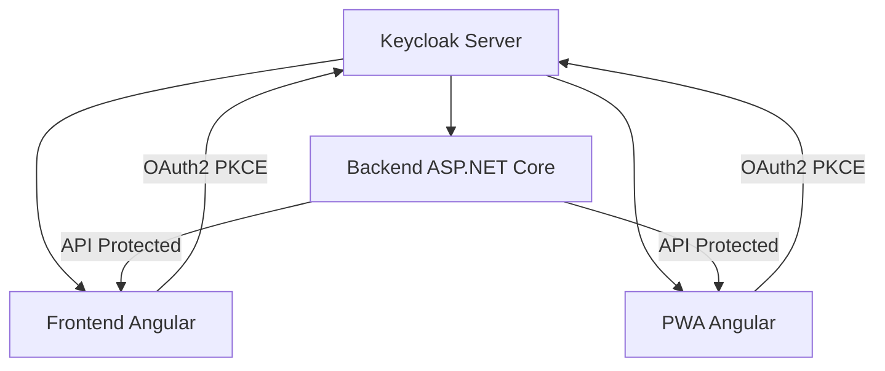

# 🔐 Guide Configuration Keycloak - Backend .NET + Angular + PWA

> Guide complet pour intégrer Keycloak avec une architecture Backend ASP.NET Core, Frontend Angular et PWA Angular. Configuration testée et optimisée.

## 📋 Vue d'ensemble de l'architecture



## 🎯 Prérequis et versions

### Versions recommandées
- **Keycloak** : 21.0+ (ou toute version moderne)
- **ASP.NET Core** : 8.0+
- **Angular** : 17+/18+
- **Node.js** : 18+

### Packages requis

**Backend .NET :**
```xml
<PackageReference Include="Microsoft.AspNetCore.Authentication.JwtBearer" Version="8.0.0" />
<PackageReference Include="Microsoft.AspNetCore.Authentication.OpenIdConnect" Version="8.0.0" />
```

**Frontend Angular :**
```bash
npm install angular-oauth2-oidc angular-oauth2-oidc-jwks
```

**PWA Angular :**
```bash
npm install angular-oauth2-oidc angular-oauth2-oidc-jwks
```

## 🔧 Configuration Keycloak Server

### 1. Création du Realm
```json
{
  "realm": "votre-realm",
  "enabled": true,
  "registrationAllowed": true,
  "loginWithEmailAllowed": true,
  "duplicateEmailsAllowed": false
}
```

### 2. Configuration Client Frontend/PWA
```json
{
  "clientId": "VOTRE_CLIENT_ID",
  "name": "Application Frontend",
  "enabled": true,
  "clientAuthenticatorType": "client-secret",
  "secret": "optionnel-pour-public-clients",
  "redirectUris": [
    "http://localhost:4200/auth/callback",
    "http://localhost:4202/auth/callback",
    "https://votre-domain.com/auth/callback"
  ],
  "webOrigins": [
    "http://localhost:4200",
    "http://localhost:4202", 
    "https://votre-domain.com"
  ],
  "publicClient": true,
  "protocol": "openid-connect",
  "attributes": {
    "pkce.code.challenge.method": "S256"
  },
  "standardFlowEnabled": true,
  "implicitFlowEnabled": false,
  "directAccessGrantsEnabled": false,
  "serviceAccountsEnabled": false
}
```

### 3. Configuration des Rôles
```json
{
  "roles": {
    "realm": [
      {
        "name": "app-user",
        "description": "Utilisateur de base"
      },
      {
        "name": "app-manager", 
        "description": "Gestionnaire"
      },
      {
        "name": "app-admin",
        "description": "Administrateur"
      }
    ]
  }
}
```

### 4. Mappers de Token (essentiels)
```json
{
  "protocolMappers": [
    {
      "name": "audience-mapper",
      "protocol": "openid-connect",
      "protocolMapper": "oidc-audience-mapper",
      "config": {
        "included.client.audience": "VOTRE_CLIENT_ID",
        "access.token.claim": "true"
      }
    },
    {
      "name": "roles-mapper",
      "protocol": "openid-connect", 
      "protocolMapper": "oidc-usermodel-realm-role-mapper",
      "config": {
        "claim.name": "roles",
        "access.token.claim": "true",
        "id.token.claim": "true",
        "userinfo.token.claim": "true"
      }
    },
    {
      "name": "email-mapper",
      "protocol": "openid-connect",
      "protocolMapper": "oidc-usermodel-property-mapper", 
      "config": {
        "user.attribute": "email",
        "claim.name": "email",
        "access.token.claim": "true",
        "id.token.claim": "true"
      }
    },
    {
      "name": "given-name-mapper",
      "protocol": "openid-connect",
      "protocolMapper": "oidc-usermodel-property-mapper",
      "config": {
        "user.attribute": "firstName", 
        "claim.name": "given_name",
        "access.token.claim": "true",
        "id.token.claim": "true"
      }
    },
    {
      "name": "family-name-mapper", 
      "protocol": "openid-connect",
      "protocolMapper": "oidc-usermodel-property-mapper",
      "config": {
        "user.attribute": "lastName",
        "claim.name": "family_name", 
        "access.token.claim": "true",
        "id.token.claim": "true"
      }
    }
  ]
}
```

## 🛠️ Configuration Backend ASP.NET Core

### 1. appsettings.json
```json
{
  "Keycloak": {
    "Authority": "https://votre-keycloak.domain.com/realms/votre-realm",
    "ClientId": "VOTRE_CLIENT_ID",
    "RequireHttps": true,
    "MetadataAddress": "https://votre-keycloak.domain.com/realms/votre-realm/.well-known/openid-configuration",
    "ValidateAudience": true,
    "ValidateIssuer": true,
    "SaveTokens": true,
    "GetClaimsFromUserInfoEndpoint": true,
    "Scope": ["openid", "profile", "email", "roles"],
    "ClockSkew": "00:05:00"
  }
}
```

### 2. Program.cs - Configuration complète
```csharp
using Microsoft.AspNetCore.Authentication.JwtBearer;
using Microsoft.IdentityModel.Tokens;
using System.Security.Claims;

var builder = WebApplication.CreateBuilder(args);

// Configuration Keycloak JWT Authentication
builder.Services.AddAuthentication(JwtBearerDefaults.AuthenticationScheme)
    .AddJwtBearer(options =>
    {
        var keycloakConfig = builder.Configuration.GetSection("Keycloak");
        
        options.Authority = keycloakConfig["Authority"];
        options.RequireHttpsMetadata = keycloakConfig.GetValue<bool>("RequireHttps");
        options.Audience = keycloakConfig["ClientId"];
        options.SaveToken = keycloakConfig.GetValue<bool>("SaveTokens");
        
        options.TokenValidationParameters = new TokenValidationParameters
        {
            ValidateIssuer = keycloakConfig.GetValue<bool>("ValidateIssuer"),
            ValidateAudience = keycloakConfig.GetValue<bool>("ValidateAudience"), 
            ValidateLifetime = true,
            ValidateIssuerSigningKey = true,
            ClockSkew = TimeSpan.Parse(keycloakConfig["ClockSkew"] ?? "00:05:00"),
            
            // Mappage des claims
            NameClaimType = ClaimTypes.Name,
            RoleClaimType = "roles"
        };

        // Événements pour debug et mappage des claims
        options.Events = new JwtBearerEvents
        {
            OnTokenValidated = context =>
            {
                var claimsIdentity = (ClaimsIdentity)context.Principal.Identity;
                
                // Ajouter des claims personnalisés si nécessaire
                if (claimsIdentity.FindFirst("email") != null)
                {
                    claimsIdentity.AddClaim(new Claim(ClaimTypes.Email, 
                        claimsIdentity.FindFirst("email").Value));
                }
                
                return Task.CompletedTask;
            },
            OnAuthenticationFailed = context =>
            {
                // Log des erreurs d'authentification
                var logger = context.HttpContext.RequestServices
                    .GetRequiredService<ILogger<Program>>();
                logger.LogError("Authentication failed: {Error}", context.Exception);
                return Task.CompletedTask;
            }
        };
    });

// Configuration Authorization avec rôles
builder.Services.AddAuthorization(options =>
{
    options.AddPolicy("UserPolicy", policy =>
        policy.RequireRole("app-user", "app-manager", "app-admin"));
        
    options.AddPolicy("ManagerPolicy", policy =>
        policy.RequireRole("app-manager", "app-admin"));
        
    options.AddPolicy("AdminPolicy", policy =>
        policy.RequireRole("app-admin"));
});

// Configuration CORS pour Frontend/PWA
builder.Services.AddCors(options =>
{
    options.AddDefaultPolicy(policy =>
    {
        policy.WithOrigins(
                "http://localhost:4200",   // Frontend Angular
                "http://localhost:4202",   // PWA Angular
                "https://votre-domain.com" // Production
            )
            .AllowAnyMethod()
            .AllowAnyHeader()
            .AllowCredentials()
            .SetPreflightMaxAge(TimeSpan.FromMinutes(10));
    });
});

builder.Services.AddControllers();

var app = builder.Build();

// Pipeline middleware
app.UseCors();
app.UseAuthentication();
app.UseAuthorization();

app.MapControllers();

app.Run();
```

### 3. Controller avec autorisation
```csharp
[ApiController]
[Route("api/[controller]")]
[Authorize(Policy = "UserPolicy")]
public class SecureController : ControllerBase
{
    [HttpGet("profile")]
    public IActionResult GetProfile()
    {
        var user = new
        {
            Id = User.FindFirst("sub")?.Value,
            Email = User.FindFirst("email")?.Value,
            FirstName = User.FindFirst("given_name")?.Value,
            LastName = User.FindFirst("family_name")?.Value,
            Roles = User.FindAll("roles").Select(c => c.Value).ToArray(),
            IsAuthenticated = User.Identity.IsAuthenticated
        };
        
        return Ok(user);
    }

    [HttpGet("admin-only")]
    [Authorize(Policy = "AdminPolicy")]
    public IActionResult AdminOnly()
    {
        return Ok("Contenu administrateur");
    }
}
```

## 🌐 Configuration Frontend Angular

### 1. Configuration OAuth (auth.config.ts)
```typescript
import { AuthConfig } from 'angular-oauth2-oidc';

export const authConfig: AuthConfig = {
  // URL de Keycloak
  issuer: 'https://votre-keycloak.domain.com/realms/votre-realm',
  
  // Configuration client
  clientId: 'VOTRE_CLIENT_ID',
  responseType: 'code',
  
  // URLs de redirection
  redirectUri: window.location.origin + '/auth/callback',
  silentRefreshRedirectUri: window.location.origin + '/silent-refresh.html',
  postLogoutRedirectUri: window.location.origin,
  
  // Scopes demandés
  scope: 'openid profile email roles',
  
  // PKCE obligatoire pour sécurité
  useSilentRefresh: true,
  silentRefreshTimeout: 5000,
  timeoutFactor: 0.75,
  sessionChecksEnabled: true,
  
  // Configuration PKCE
  showDebugInformation: false, // Mettre à true en dev
  requireHttps: true, // false en développement local
  strictDiscoveryDocumentValidation: false,
  
  // Claims mapping
  customQueryParams: {},
  
  // Configuration avancée
  clearHashAfterLogin: true,
  nonceStateSeparator: 'semicolon' // Pour compatibilité
};
```

### 2. Service d'authentification (auth.service.ts)
```typescript
import { Injectable } from '@angular/core';
import { OAuthService, AuthConfig } from 'angular-oauth2-oidc';
import { JwksValidationHandler } from 'angular-oauth2-oidc-jwks';
import { BehaviorSubject, Observable } from 'rxjs';
import { Router } from '@angular/router';
import { authConfig } from './auth.config';

export interface UserInfo {
  id: string;
  userId: string;
  email: string;
  firstName: string;
  lastName: string;
  roles: string[];
  isAuthenticated: boolean;
}

@Injectable({
  providedIn: 'root'
})
export class AuthService {
  private userInfoSubject = new BehaviorSubject<UserInfo | null>(null);
  public userInfo$ = this.userInfoSubject.asObservable();

  private isAuthenticatedSubject = new BehaviorSubject<boolean>(false);
  public isAuthenticated$ = this.isAuthenticatedSubject.asObservable();

  constructor(
    private oauthService: OAuthService,
    private router: Router
  ) {
    this.configureOAuth();
    this.setupTokenRefresh();
  }

  private async configureOAuth(): Promise<void> {
    // Configuration OAuth
    this.oauthService.configure(authConfig);
    this.oauthService.tokenValidationHandler = new JwksValidationHandler();

    // Événements OAuth
    this.oauthService.events.subscribe(event => {
      if (event.type === 'token_received' || event.type === 'token_refreshed') {
        this.updateUserInfo();
      } else if (event.type === 'logout' || event.type === 'token_expires') {
        this.clearUserInfo();
      }
    });

    try {
      // Chargement de la configuration depuis Keycloak
      await this.oauthService.loadDiscoveryDocument();
      
      // Vérification si on revient d'une authentification
      await this.oauthService.tryLoginImplicitFlow();
      
      if (!this.oauthService.hasValidAccessToken()) {
        // Tentative de refresh silencieux
        await this.oauthService.silentRefresh();
      }
      
      if (this.oauthService.hasValidAccessToken()) {
        this.updateUserInfo();
      }
    } catch (error) {
      console.error('❌ Erreur configuration OAuth:', error);
    }
  }

  private setupTokenRefresh(): void {
    // Refresh automatique des tokens
    this.oauthService.setupAutomaticSilentRefresh();
  }

  async login(): Promise<void> {
    try {
      await this.oauthService.loadDiscoveryDocument();
      this.oauthService.initCodeFlow();
    } catch (error) {
      console.error('❌ Erreur lors de la connexion:', error);
      throw error;
    }
  }

  logout(): void {
    this.oauthService.logOut();
    this.clearUserInfo();
    this.router.navigate(['/']);
  }

  private updateUserInfo(): void {
    const claims = this.oauthService.getIdentityClaims();
    if (claims) {
      const userInfo: UserInfo = {
        id: claims['sub'] || '',
        userId: claims['sub'] || '',
        email: claims['email'] || '',
        firstName: claims['given_name'] || '',
        lastName: claims['family_name'] || '',
        roles: this.extractRoles(claims),
        isAuthenticated: true
      };
      
      this.userInfoSubject.next(userInfo);
      this.isAuthenticatedSubject.next(true);
    }
  }

  private extractRoles(claims: any): string[] {
    // Extraction des rôles depuis différents emplacements possibles
    const roles = claims['roles'] || claims['realm_access']?.roles || [];
    return Array.isArray(roles) ? roles : [roles].filter(Boolean);
  }

  private clearUserInfo(): void {
    this.userInfoSubject.next(null);
    this.isAuthenticatedSubject.next(false);
  }

  // Méthodes utilitaires
  hasRole(role: string): boolean {
    const userInfo = this.userInfoSubject.value;
    return userInfo?.roles?.includes(role) || false;
  }

  hasAnyRole(roles: string[]): boolean {
    const userInfo = this.userInfoSubject.value;
    return roles.some(role => userInfo?.roles?.includes(role)) || false;
  }

  getAccessToken(): string | null {
    return this.oauthService.getAccessToken();
  }

  isLoggedIn(): boolean {
    return this.oauthService.hasValidAccessToken() && this.isAuthenticatedSubject.value;
  }
}
```

### 3. Configuration de l'application (app.config.ts)
```typescript
import { ApplicationConfig } from '@angular/core';
import { provideRouter } from '@angular/router';
import { provideHttpClient, withInterceptors } from '@angular/common/http';
import { OAuthModule } from 'angular-oauth2-oidc';
import { importProvidersFrom } from '@angular/core';

import { routes } from './app.routes';
import { authInterceptor } from './core/interceptors/auth.interceptor';

export const appConfig: ApplicationConfig = {
  providers: [
    provideRouter(routes),
    provideHttpClient(withInterceptors([authInterceptor])),
    importProvidersFrom(
      OAuthModule.forRoot({
        resourceServer: {
          allowedUrls: ['http://localhost:5793/api'], // URL de votre API
          sendAccessToken: true
        }
      })
    ),
  ]
};
```

### 4. Intercepteur HTTP (auth.interceptor.ts)
```typescript
import { HttpInterceptorFn } from '@angular/common/http';
import { inject } from '@angular/core';
import { OAuthService } from 'angular-oauth2-oidc';

export const authInterceptor: HttpInterceptorFn = (req, next) => {
  const oauthService = inject(OAuthService);
  
  // Ajouter le token d'authentification si disponible
  if (oauthService.hasValidAccessToken()) {
    const token = oauthService.getAccessToken();
    const authReq = req.clone({
      setHeaders: {
        Authorization: `Bearer ${token}`
      }
    });
    return next(authReq);
  }
  
  return next(req);
};
```

### 5. Guard de protection de routes (auth.guard.ts)
```typescript
import { Injectable } from '@angular/core';
import { CanActivate, Router } from '@angular/router';
import { Observable } from 'rxjs';
import { map, tap } from 'rxjs/operators';
import { AuthService } from '../services/auth.service';

@Injectable({
  providedIn: 'root'
})
export class AuthGuard implements CanActivate {
  constructor(
    private authService: AuthService,
    private router: Router
  ) {}

  canActivate(): Observable<boolean> {
    return this.authService.isAuthenticated$.pipe(
      tap(isAuthenticated => {
        if (!isAuthenticated) {
          // Stocker l'URL demandée
          sessionStorage.setItem('returnUrl', window.location.pathname);
          this.router.navigate(['/login']);
        }
      })
    );
  }
}
```

## 📱 Configuration PWA Angular

### Différences par rapport au Frontend

La configuration PWA est **identique** au Frontend Angular, avec ces particularités :

### 1. Port différent dans auth.config.ts
```typescript
export const authConfig: AuthConfig = {
  // ... même configuration
  redirectUri: window.location.origin + '/auth/callback', // Port 4202 pour PWA
  // ... reste identique
};
```

### 2. Configuration API dans environment
```typescript
// environment.ts
export const environment = {
  production: false,
  apiUrl: 'http://localhost:5793' // URL du backend
};

// environment.prod.ts  
export const environment = {
  production: true,
  apiUrl: 'https://votre-api.domain.com'
};
```

### 3. Service Worker et PWA
```typescript
// app.config.ts pour PWA
import { provideServiceWorker } from '@angular/service-worker';

export const appConfig: ApplicationConfig = {
  providers: [
    // ... autres providers
    provideServiceWorker('ngsw-worker.js', {
      enabled: environment.production,
      registrationStrategy: 'registerWhenStable:30000'
    }),
  ]
};
```

## 🔒 Sécurité et meilleures pratiques

### 1. Configuration HTTPS
```bash
# Développement local avec certificat auto-signé
ng serve --ssl --ssl-key path/to/key.pem --ssl-cert path/to/cert.pem
```

### 2. Variables d'environnement sensibles
```typescript
// Ne JAMAIS committer les secrets en dur
export const environment = {
  production: true,
  keycloak: {
    url: process.env['KEYCLOAK_URL'] || 'https://default-keycloak.com',
    realm: process.env['KEYCLOAK_REALM'] || 'default-realm',
    clientId: process.env['KEYCLOAK_CLIENT_ID'] || 'default-client'
  }
};
```

### 3. Validation côté Backend
```csharp
// Toujours valider les permissions côté serveur
[Authorize(Policy = "UserPolicy")]
public IActionResult SecureEndpoint()
{
    // Double vérification des rôles
    if (!User.IsInRole("app-user"))
    {
        return Forbid();
    }
    
    return Ok();
}
```

## 🚨 Dépannage courant

### Problème : "Invalid audience"
**Solution :** Vérifier le mapper d'audience dans Keycloak et `ValidateAudience` côté backend.

### Problème : "CORS error"
**Solution :** Ajouter l'origine dans la configuration CORS backend et les `webOrigins` Keycloak.

### Problème : "Token refresh failed"
**Solution :** Vérifier la configuration `silentRefreshRedirectUri` et créer le fichier `silent-refresh.html`.

### Problème : Rôles non récupérés
**Solution :** Vérifier les protocol mappers Keycloak et le mapping des claims côté Angular.

## 📝 Checklist de déploiement

### Keycloak
- [ ] Realm configuré avec les bons paramètres
- [ ] Client créé avec redirect URIs de production
- [ ] Protocol mappers configurés
- [ ] Rôles créés et assignés
- [ ] HTTPS activé

### Backend .NET
- [ ] Configuration Keycloak en production
- [ ] CORS configuré pour les domaines de production
- [ ] Logs d'authentification activés
- [ ] Variables d'environnement sécurisées

### Frontend/PWA Angular
- [ ] URLs de production dans auth.config
- [ ] Certificats HTTPS valides
- [ ] Service Worker configuré (PWA)
- [ ] Variables d'environnement configurées
- [ ] Build de production testé

---

> **Note :** Cette configuration a été testée et validée sur l'architecture LEXI Task Manager avec Keycloak 21+, ASP.NET Core 8 et Angular 18. Adaptez les URLs et noms selon vos besoins spécifiques.